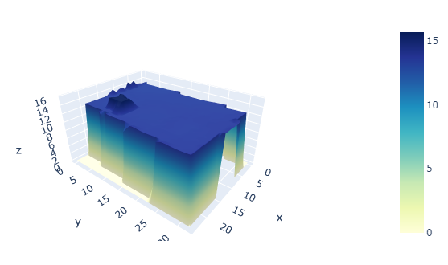

# 3D House Project

Modeling a house in 3D with only a home address

## Overview

This project attempts to generate a 3D represenation of a building using geo spatial data. 

## Details

* The project is made in python 3.7
* Raster and Vector data of Flanders are used as input data
* Geopunt APIs are used to fetch geographical coordinates as well as shapes/polygons of a particular address.
* The final product is a 3D model of a building

### Final Product:

### Data

Data is in the form of geotiff files available at the below link

- [DSM](http://www.geopunt.be/download?container=dhm-vlaanderen-ii-dsm-raster-1m&title=Digitaal%20Hoogtemodel%20Vlaanderen%20II,%20DSM,%20raster,%201m)
- [DTM](http://www.geopunt.be/download?container=dhm-vlaanderen-ii-dtm-raster-1m&title=Digitaal%20Hoogtemodel%20Vlaanderen%20II,%20DTM,%20raster,%201m)

For more information
-[Belgium cadastral information](https://financien.belgium.be/nl/experten_partners/kadastraal-plan/downloaden) 

#### Third party APIs available at:

- (https://nominatim.org/)   
- (http://www.geopunt.be)   

